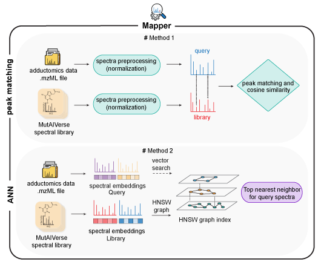
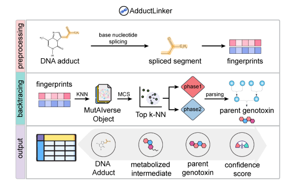

# MutAIverse
The MutAIverse package streamlines adductomics research by enabling the screening of untargeted metabolomics data against a vast in silico MS/MS spectral library of Generative AI synthesized DNA adductome (MutAIverse spectral library) and experimentally validated adducts, facilitating the identification of DNA adducts that are formed due to genotoxin/carcinogen exposure along with the predictive capabilities of Adduct Linker module to determine potential source genotoxins responsible for the DNA adduct formation, establishing a direct link between DNA adducts and the genotoxins or carcinogens that trigger their formation. MutAIverse seeks to overcome the current limitations and pave the way for a more precise, efficient, and personalized assessment of the exposome.


The single strong dependency for this resource is **[RDKit](https://www.rdkit.org/)**, which can be installed in a local [Conda](https://conda.io/) environment.

**Other dependencies**
1. matchms (v0.13.0)
2. hnswlib (v0.8.0)
3. gensim (v4.3.1)
4. pandas (v1.5.3)
5. numpy (v1.23)
6. matplotlib (v3.7.1)
7. seaborn (v0.12.2)
8. tqdm (v4.65.0)

## How to use MutAIverse?

### Installation using pip 
```
$ pip install -i https://test.pypi.org/simple/MutAIverse
```
MutAIverse has 2 distinct modules:<br/>
1. Mapper
2. AdductLinker

## Mapper module
Mapper module provides two approaches for mapping query MS spectra against *in silico* MS/MS spectral library of Experimentally validated adducts or Synthetic DNA adducts of MutAIverse.
 <br>
<div align="center">
</div>
<br>

#### MutAIverse Library setup
This is a one-time task that must be completed to use the Mapper module after installing the package for the first time.
```Python
from MutAIverse import Mapper
Mapper.load_library()
```
The function fetches the library data (1.5G) to be used by the Mapper module in the future. 

### Brute force Approach 
Cosine Similarity-based mapping 

```Python
from MutAIverse import Mapper
Mapper.map('bonafide_adducts',sample_file_path='/path-to-mzML-file',MS_level=1,plot=True)

```

Additional arguments 

    Parameters:
    - library (str): bonafide_adducts/MutAIverse.
    - sample_file_path (str): Path to the mzML file containing mass spectrometry data.
    - ms level (int): 1 (MS spectrum) or 2 (MS/MS spectrum).
    - plot (bool; default True): for visualizations.
    return
    - Result CSV file with suffix _MutAIversee_results.csv or _bonafide_adducts_results.csv.


### Quick Search Approach 
Approximate Nearest Neighbour-based mapping, which executes through 2 steps
1. Generation of spectral embeddings from query MS spectra
2. Mapping using the HNSW index of the spectral embeddings

```python
from MutAIverse import Mapper
Mapper.fast_map(mzml_file_path)

```

Additional arguments 

    Parameters:
    - mzml_file_path (str): Path to the mzML file containing mass spectrometry data.
    - level (int; default 2): 1 (MS spectrum) or 2 (MS/MS spectrum)
    - k (int; default 1): Number of nearest neighbors to search for.
    - ef_query (int; default 300): Parameter controlling the number of elements to visit during a query.
    - Energy (int; default 0): Collision energy
    
    Returns:
    - pandas.DataFrame: DataFrame containing search results with columns ['Query_Index', 'Nearest_Neighbor_Index', 'Cosine Similarity', 'SMILES', 'COMPID', 'Structures'].
    - visualizations(density plot and histograms)


## AdductLinker module
 <br>
<div align="center">
</div>
<br>
MutAIverse is also capable of re-tracing a DNA adduct to its possible source Genotoxin.


### Fragment-based linking 
Biotransformation backtracking based on abnormalities spliced from the base nucleotides.

```python
from MutAIverse import Linker
query_smiles = 'OC[C@H]1O[C@H](CC1O)n1c[n+](c2c1nc(N)[nH]c2=O)C1OC2C(C1O)c1c(O2)cc(c2c1oc(=O)c1c2CCC1=O)OC' 
Linker.backtrace(Adduct = query_smiles)

```

Additional arguments 

    Parameters:
    - Adduct (str): Path to the mzML file containing mass spectrometry data.
    - knn (int; default 20): Number of nearest neighbors to narrow down the search space. 
    - tophit (int; default 5): Minimum number of Genotoxins to be linked.
    - plot (bool; default False): Traced SMILES 2D structures in rows.
    - cutoff (int; default 80): Link Probability(%) cutoff.
    
    Returns:
    - pandas.DataFrame: DataFrame containing search results with columns ['Query', 'Fragment', 'Metabolites', 'N-Transformation', 'Genotoxin', 'Probability'].
    - visualizations(Traced smiles 2D structures in rows)


This module also has a sub-function dedicated only to visualize backtrace() output with a user-supplied probability threshold.
```python
import pandas as pd
from MutAIverse import Linker 
Linker.plot_trace(file='/Path-to-Output_file.csv')
```

Additional arguments 

    Parameters:
    - file (str): Output CSV file (with path) of Linker.backtrace() function
    - cutoff (int; default 80): Minimum probability threshold 
    Returns:
    - visualizations(Traced SMILES 2D structures in rows)
  
